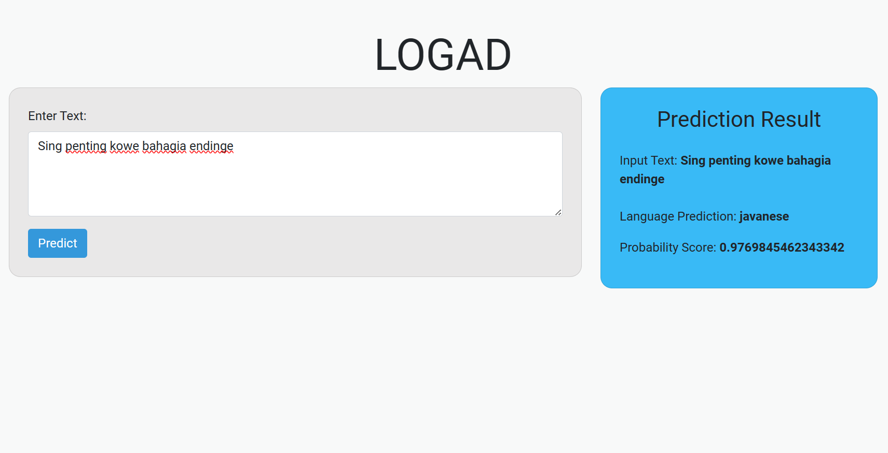
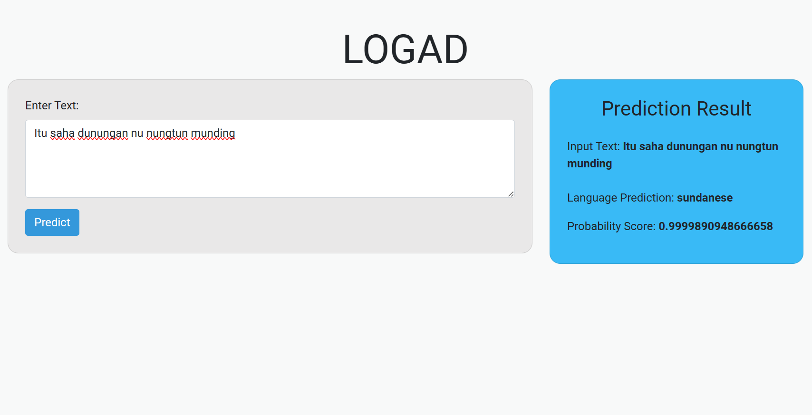

# Logad (Local Language Detection)
The objective of this initiative is to create a system with the capability to detect local languages or dialects based on textual input. Approach involves assembling a dataset comprising text samples in diverse regional languages or dialects, followed by the training of machine learning models for the purpose of identification and classification.

## Logad Model
This [Model](/ipynbFile) using Multi Layer Perceptron (MLP) and TF-IDF Vectorizer. The model using [datasets](/datasets) from [IndoNLP](https://github.com/IndoNLP/nusax) GitHub account. So far, this model uses three local language datasets: Javanese, Sundanese, and Indonesian. So the model can only detect these three languages.

## How to Run Logad App
- Clone or download the [FlaskLogad](/FlaskLogad) folder from my GitHub repository.
- Install virtualenv in the folder containing app.py and others:
    1. Run the command -> **python -m venv myenv** (myenv is the environment name, you can change it according to your preference)
    2. Activate the virtual environment using -> **myenv\Scripts\activate**
    3. Install the required packages using -> **pip install -r requirements.txt**
- Run the application using the command -> **python app.py**

### Example Result 1

### Example Result 2

### Example Result 3

## References
- https://arxiv.org/pdf/2101.03963
- https://github.com/IndoNLP/nusax